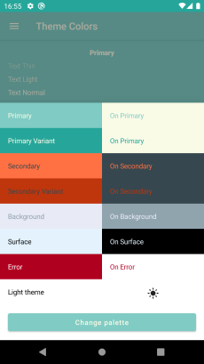
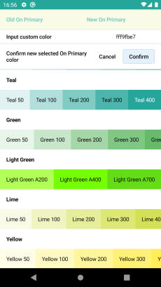
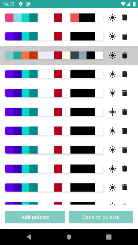
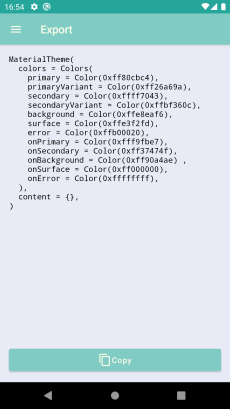

# 🎨 Compose Theme Builder

With this application you can create compose theme. Application allows creating colors scheme with material and custom
colors. Then you can export result as Kotlin code.

### 🛠 Roadmap

+ Fixing bugs
+ Adding Compose shape customization
+ Improving UX
+ Adding iOS support
+ Adding Compose components customization
+ Import theme

### ⚙️ Tech Stack

+ [Kotlin](https://kotlinlang.org/)
+ [Kotlin Coroutines](https://github.com/Kotlin/kotlinx.coroutines)
+ [Compose Multiplatform, by JetBrains](https://github.com/JetBrains/compose-jb)
+ [Decompose](https://github.com/arkivanov/Decompose)
+ [MVIKotlin](https://github.com/arkivanov/MVIKotlin)
+ [SQLDelight](https://github.com/cashapp/sqldelight)
+ [Multiplatform Settings](https://github.com/russhwolf/multiplatform-settings)

### 📸 Screenshots:

   

### 📱 Stores

