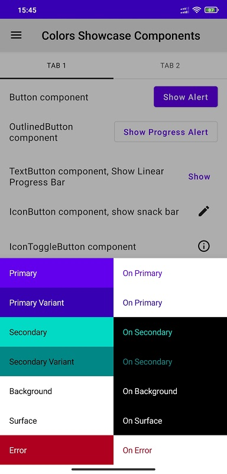
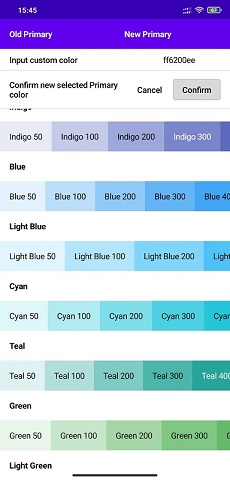

# 🎨 Compose Theme Builder

With this application You can create compose theme. Application allows to create colors scheme with material and custom
colors. Then You can export result as Kotlin code.

### 📸 Screenshots:

 

### 🛠 Road Map

+ Fixing bugs
+ Adding Compose shape customization
+ Improving UX
+ Adding iOS support
+ Adding Compose components customization

### ⚙️ Tech stack

+ [Kotlin](https://kotlinlang.org/)
+ [Kotlin Coroutines](https://github.com/Kotlin/kotlinx.coroutines)
+ [Compose Multiplatform, by JetBrains](https://github.com/JetBrains/compose-jb)
+ [Decompose](https://github.com/arkivanov/Decompose)
+ [MVIKotlin](https://github.com/arkivanov/MVIKotlin)